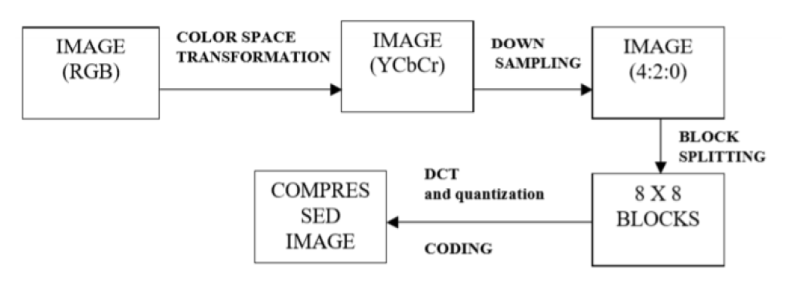
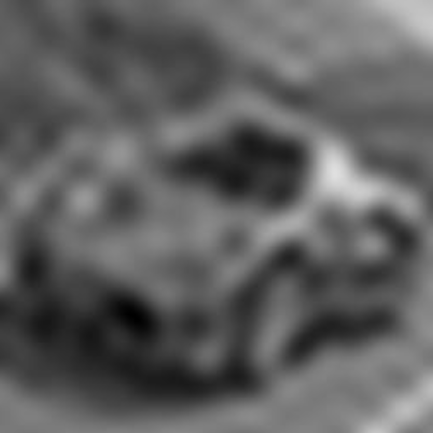

# Discrete Cosine Transform for Intelligent Image Compression

## Problem Statement
This project aims to provide an overview of the Discrete Cosine Transform (DCT) based image compression technique and its implementation steps. The objective is to compress the size of JPEG images without significant loss in quality.

## Block Diagram

## Methodology
1. **Color Space Transformation**
   - Conversion from RGB to YCbCr color space.
   - Y represents brightness, and Cb and Cr represent chrominance.

2. **Down Sampling**
   - Reduction of spatial resolution of Cb and Cr components.

3. **Block Splitting**
   - Splitting each channel into 8x8 blocks of pixels.

4. **DCT Definitions**
   - Implementing the Discrete Cosine Transform on 8x8 blocks.

5. **Performing DCT Operations and Quantization**
   - Application of DCT on each block followed by quantization.

6. **Entropy Coding**
   - Compression of quantized matrix coefficients.

7. **Decompression**
   - Reconstruction of the image from compressed data.

8. **Comparison of Matrices**
   - Analyzing and comparing matrices at different compression levels.

## Results
Showcasing the impact of different compression levels on the number of coefficients different from zero.

| Compression Level | Image                                |
|-------------------|--------------------------------------|
| (a) 100 coefficients different from zero |  |
| (b) 400 coefficients different from zero |  |
| (c) 1600 coefficients different from zero |  |
| (d) 6400 coefficients different from zero |  |
| (e) 65536 coefficients different from zero |  |

